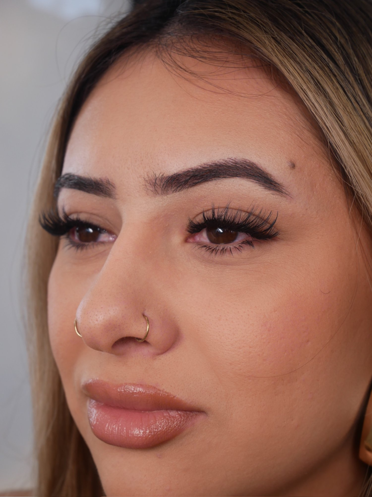

# The Lux Beauty Co.

**Live Site:** [theluxbeautyco.com](https://theluxbeautyco.com)

A fully custom, production-ready one-page website built for a lash and brow specialist based in San Mateo, CA. Designed and developed from scratch with no templates or frameworks.

---

## Preview



---

## Features

- Custom CSS animations including shimmer gold text and floating sparkle effects
- Animated SVG logo that draws itself in on page load
- Tabbed services menu with full real-world pricing (Lash Sets, Fills, Brows, Wax)
- Third-party booking integration via Acuity Scheduling embed
- Responsive mobile layout
- Interactive gallery grid with hover overlays
- Custom domain with SSL certificate via Netlify

---

## Tech Stack

- HTML5
- CSS3 (custom animations, CSS Grid, Flexbox)
- Vanilla JavaScript (tab switching)
- SVG (animated logo)
- Deployed via **Netlify**
- Domain managed via **Squarespace Domains**

---

## Project Structure

```
lux-beauty-co/
├── index.html        # Main site file
├── hero.jpg          # Hero section photo
├── about.jpg         # About section photo
├── gallery-1.jpg     # Gallery images
├── gallery-2.jpg
├── gallery-3.jpg
├── gallery-4.jpg
├── gallery-5.jpg
├── gallery-6.jpg
├── gallery-7.jpg
└── README.md
```

---

## Deployment

The site is deployed on **Netlify** with a custom domain connected via Squarespace DNS. SSL is automatically provisioned via Let's Encrypt.

---

## Client

Built for **The Lux Beauty Co.** — a lash and brow studio offering Classic, Hybrid, Volume, and Mega Volume lash sets, brow lamination, tinting, waxing, and more.

---

*Designed & developed by Brandon Sanchez — [github.com/Bsanchez650](https://github.com/Bsanchez650)*
